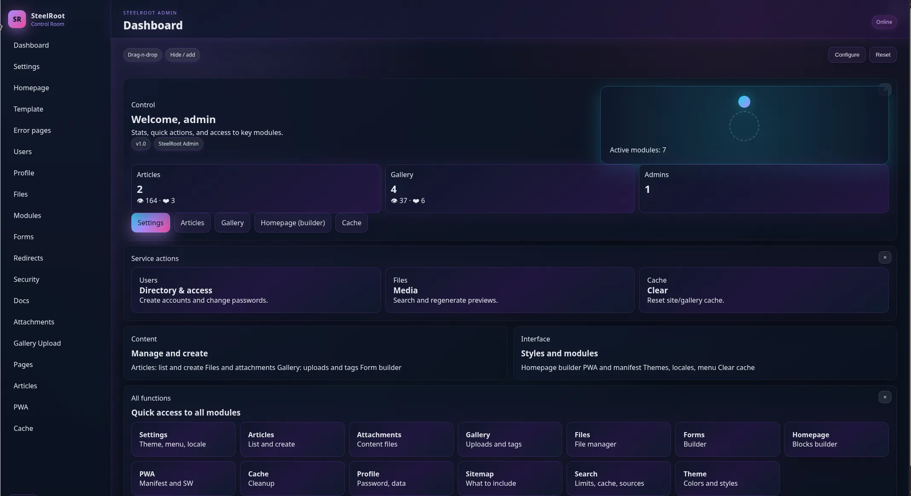
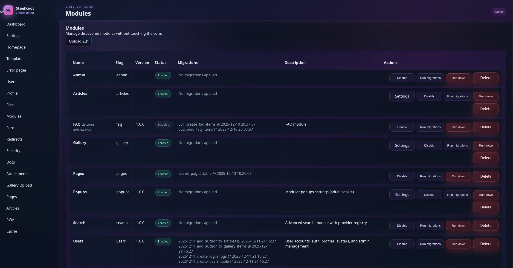
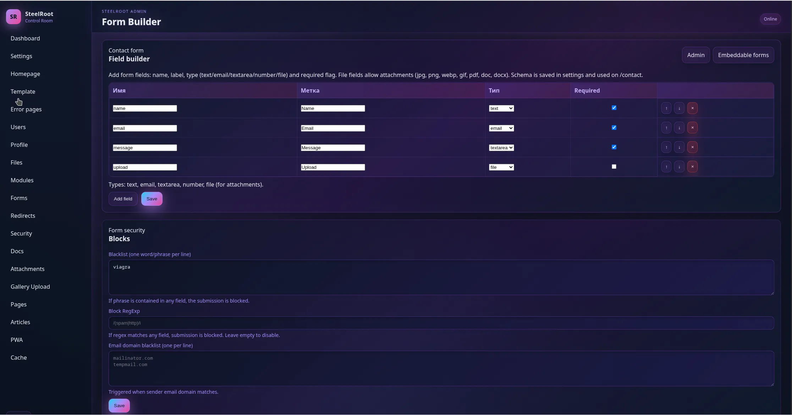
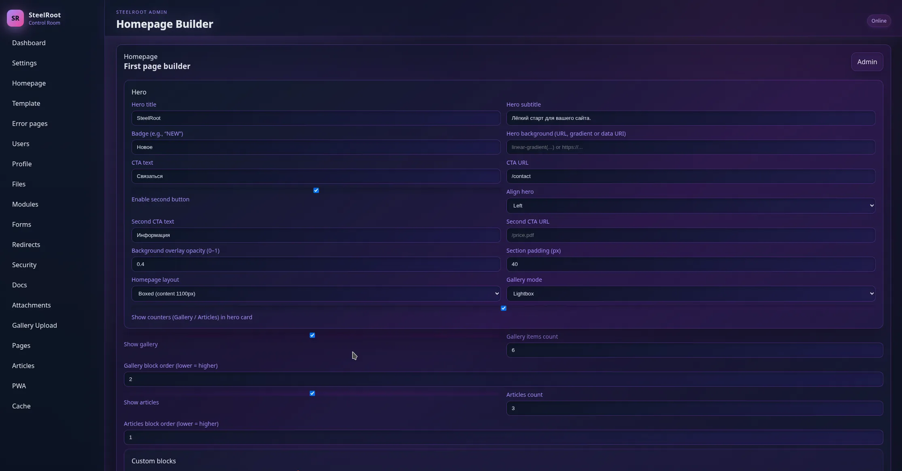

# SteelRoot
Modular PHP CMS focused on clarity, security, and sane defaults.

📘 Русская версия: [README.ru.md](README.ru.md)

---

## SteelRoot CMS

Modular PHP CMS for shared hosting (`public_html`).
Ships with an admin panel, themes, i18n (en/ru), articles, gallery, popups,
pages, forms, search, and PWA support.

---

## Screenshots

### Admin Dashboard


### Modules Manager


### Forms Builder


### Homepage Builder


## Requirements
- PHP 8.1+ with extensions: pdo, pdo_mysql, mbstring, json, openssl, fileinfo, gd.
- MySQL/MariaDB.
- Web server with URL rewrite (Apache/Nginx) pointing to `public_html/`.
- Writable: `public_html/storage/{cache,logs,tmp,uploads/*}`, `public_html/database/migrations`. See `DEPENDENCIES.md` for full checklist.

## Quick start

**Option A — one-liner (no git required):**
```bash
bash <(curl -fsSL https://raw.githubusercontent.com/ierofant/SteelRoot/main/setup.sh)
```

**Option B — clone:**
```bash
git clone https://github.com/ierofant/SteelRoot.git
cd SteelRoot/public_html
bash setup.sh          # checks PHP, creates storage dirs, installs composer deps
```

Then open `http://your-domain/installer.php` in a browser to finish setup.

## Install (browser)
1) Run `bash setup.sh` after cloning — it verifies requirements and creates all needed directories.
2) Point vhost to `public_html/` with rewrites to `prefilter.php`.
3) Open `installer.php` in browser, fill DB/admin, optional admin_secret for custom prefix. Installer writes configs and runs migrations (core + pages table).
4) Delete `installer.php` after success.

Config files `app/config/app.php` and `app/config/database.php` are generated; examples: `app/config/app.example.php`, `database.example.php`.

## Structure (key)
```
public_html/
  index.php / prefilter.php / .htaccess
  core/        # kernel, router, DI, renderer, lang, cache, Meta (JSON-LD)
  app/         # controllers, services, views, lang, config
  modules/     # Admin, Articles, Gallery, Popups, Pages, Users, Search
  database/    # migrations/, seeds/, MigrationRunner.php
  storage/     # cache, logs, tmp, uploads/{gallery,articles,users}
  assets/      # scss/css/js; build via tools/build_sass.sh (sass or npx sass)
```

## Features (current)
- **Articles**: list/detail, tags, previews, meta; admin CRUD, module settings; **author field** (user dropdown); **categories** with images, slug, position, enabled flag; locale_mode-aware forms (EN/RU/both); **JSON-LD structured data** (Schema.org Article + Organization).
- **Gallery**: masonry list, lightbox, likes/views, tags; admin upload/edit/delete, module settings, sitemap provider; **categories** with cover images and subfolder organisation; **folder picker** on upload (existing folders + create new); locale_mode-aware upload form with file preview.
- **File Manager** (`/admin/files`): filesystem browser for `storage/uploads/`; folder navigation with breadcrumbs; upload, create folder, delete file/empty-folder; path-traversal protected.
- **Attachments** (`/admin/attachments`): article image popup picker; upload, delete, insert URL into editor; directories excluded from listing.
- Pages: static pages with admin CRUD, menu integration, sitemap; embeds handled in content.
- Menu: configurable RU/EN labels, SEO meta, OG image; supports one-level dropdowns (parent/child).
- Embeddable forms: admin tab `/admin/forms/embeds`, JSON-defined fields, localized success, embed via `{{ form:slug }}`; CSRF/rate-limit/spam protections reused from contact form.
- Users: auth/registration/profile with avatars; admin user management; registration settings `/admin/users/settings` (enable/disable, email verification, default role, username/password rules, domain allow/deny, IP/CIDR blocks, rate limit, optional auto-login).
- Error pages: admin `/admin/template/errors` per-code (403/404/500/503) custom content (title/message/description/CTA/icon/home button) with safe rendering.
- Popups: cookie/adult popups with delays/targets; admin UI `/admin/popups`.
- Redirects: `/admin/redirects` with cache; handled before 404.
- Search: full-text articles/gallery with source filters; autocomplete tags; API v1.
- PWA: admin-managed manifest/SW version/cache list; runtime cache with versioning.
- **SEO & Structured Data**: JSON-LD infrastructure (`core/Meta`); auto-generated Schema.org markup for articles; extensible for other modules; Google Rich Results compatible.
- Themes: light/dark via tokens/variables; no inline colors.
- i18n: lang files per app/module; helper `__()`; **locale_mode** setting (`en`/`ru`/`multi`) hides irrelevant language fields across all admin forms.
- Cache: file cache; sitemap cached 10 min.
- Module system: `core/ModuleManager`, per-module migrations (`ModuleMigrationRunner`), lang/views/routes providers.

## HTTP Prefilter

Requests are routed through a prefilter before hitting the application.
The prefilter blocks forbidden file extensions, path traversal, and basic injection patterns,
then applies per-IP rate limiting (120 req / 60 s) and falls through to `index.php`.

Two variants are provided:

| File | Rate limiting backend |
|------|-----------------------|
| `prefilter.php` | File-based (`storage/tmp/prefilter_rate.json`, flock) |
| `prefilter.redis.php` | Redis via Unix socket (`/run/redis/redis.sock`, db 1) |

**Using the Redis variant** — point your vhost / `.htaccess` `php_value auto_prepend_file` or
`FallbackResource` entry at `prefilter.redis.php` instead of `prefilter.php`.
Requires the `php-redis` extension. If Redis is unavailable the filter fails open
(request is allowed through) so the site stays up.

Redis key format: `prefilter:rate:{ip}` with a 60-second TTL set on the first increment.

## Development
- DI via `Container::set/singleton/get`, no autowiring.
- Router supports middleware/groups; 404 handled by Kernel error views.
- Run migrations via `/migrate?up|down|status` (web) or `database/MigrationRunner.php`.
- SCSS build: `bash tools/build_sass.sh` (uses sass or npx sass).
- JSON-LD: see docs for adding structured data to modules (create Schema Providers, use `JsonLdRenderer`).
- Avoid committing generated configs (`app/config/app.php`, `database.php`), uploads, cache, tmp; see `.gitignore`.

## Deployment notes
- Keep `vendor/` out of VCS unless required for zero-composer deploys.
- Ensure `storage/tmp/user_tokens` and `storage/uploads/users` exist for Users module.
- Admin prefix configurable via `admin_secret`; stored in `app/config/app.php`.

## License

MIT © 2025 ierofant

SteelRoot is released under the MIT License.
You are free to use, modify, and distribute it.
Commercial usage is allowed.
